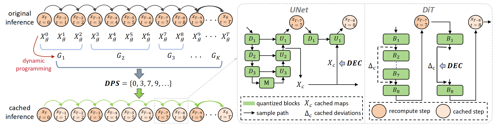
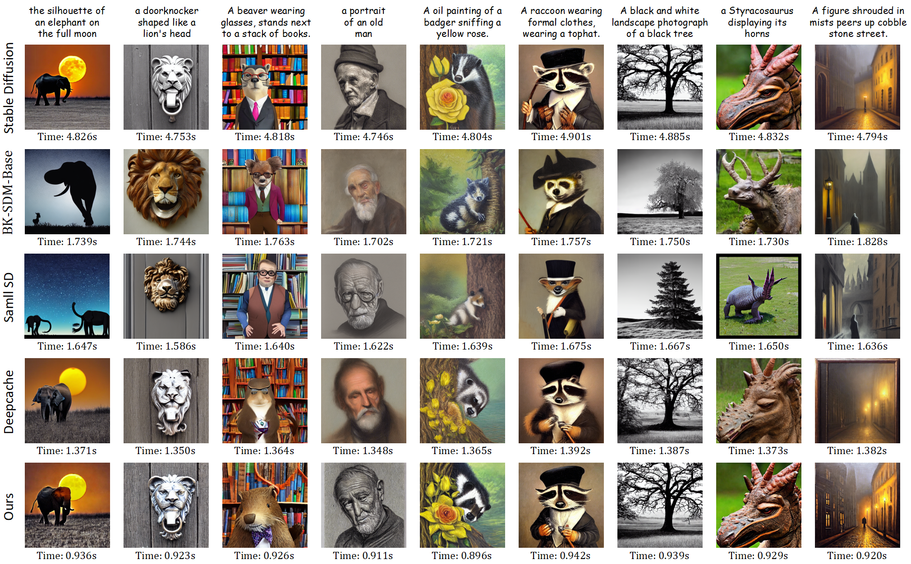
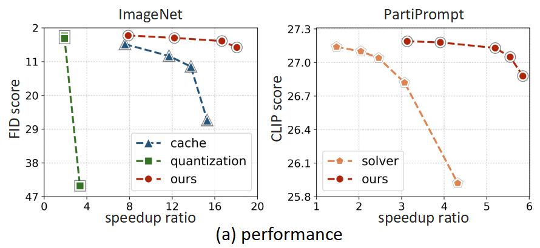
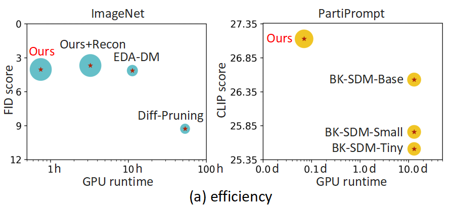

# 🚀CacheQuant: Comprehensively Accelerated Diffusion Models

## 📖 Introduction
This repository contains the official PyTorch implementation for the CVPR2025 paper
*["CacheQuant: Comprehensively Accelerated Diffusion Models"](http://arxiv.org/abs/2503.01323).* CacheQuant introduces a novel training-free paradigm that comprehensively accelerates diffusion models at both temporal and structural levels. The DPS selects the optimal cache schedule to minimize errors caused by caching and quantization. The DEC further mitigates the coupled and accumulated errors based on the strong correlation of feature maps.
<!-- *["CacheQuant: Comprehensively Accelerated Diffusion Models"](-).* -->
<div align=center>
  
</div>

## 🔓 Preparation

### 🗝️ Environment
Create and activate a suitable conda environment named `cachequant` by using the following command:

```bash
cd CacheQuant
conda env create -f environment.yaml
conda activate cachequant
```

### 💠 Pretrained Model
Pre-trained models for DDPM are automatically downloaded by the code. For LDM and Stable Diffusion experiments, download relevant pre-trained models to `mainldm/models/ldm` following the instructions in the *[latent-diffusion](https://github.com/CompVis/latent-diffusion#model-zoo)* and *[stable-diffusion](https://github.com/CompVis/stable-diffusion#weights)* repos. 

### 📕 Data
Please download all original datasets used for evaluation from each dataset’s official website. We provide prompts for Stable Diffusion in `mainldm/prompt`. 


## Example: 🖼️ image generation (LDM on ImageNet)

### 🔧 Usage

1. Obtain DPS and Calibration
```bash
python ./mainldm/sample_cachequant_imagenet_cali.py
```
2. Get Cached Features
```bash
python ./mainldm/sample_cachequant_imagenet_predadd.py
```
3. Calculate DEC for Cache
```bash
python ./err_add/imagenet/imagenet_dec.py --error cache
```
4. Get Quantized Parameters
```bash
python ./mainldm/sample_cachequant_imagenet_params.py
```
5. Calculate DEC for Quantization
```bash
python ./err_add/imagenet/imagenet_dec.py --error quant
```
6. Acceleration and Sample
```bash
python ./mainldm/sample_cachequant_imagenet_quant.py <--recon>
```
The `--recon` to use reconstruction.

### 🔍 Details
This work is built upon [EDA-DM](https://github.com/BienLuky/EDA-DM) as the baseline. The repo provides code for all experiments. We use the LDM-4 on ImageNet as an example to illustrate the usage. Other experiments are implemented similarly. Our experiments are aligned with [Deepcache](https://github.com/horseee/DeepCache): non-uniform caching is used for stable-diffusion, and for other models only when `intervel` is greater than 10. We use the [guided-diffusion](https://github.com/openai/guided-diffusion) and [clip-score](https://github.com/Taited/clip-score) to evaluate results. The accelerated diffusion models are deployed by utilizing [CUTLASS](https://github.com/NVIDIA/cutlass) and [torch_quantizer](https://github.com/ThisisBillhe/torch_quantizer).

## 📊 Visualization
### 🔹Random samples (Stable-Diffusion 5.18× Acceleration)
<div align=center>
  
</div>

### 🔹Performance and Efficiency
<div align=center>
  
  
</div>

## 📚 Citation

If you find this work useful in your research, please consider citing our paper:

```bibtex
@inproceedings{liu2025cachequant,
  title={Cachequant: Comprehensively accelerated diffusion models},
  author={Liu, Xuewen and Li, Zhikai and Gu, Qingyi},
  booktitle={Proceedings of the Computer Vision and Pattern Recognition Conference},
  pages={23269--23280},
  year={2025}
}

@article{liu2024enhanced,
  title={Enhanced distribution alignment for post-training quantization of diffusion models},
  author={Liu, Xuewen and Li, Zhikai and Xiao, Junrui and Gu, Qingyi},
  journal={arXiv e-prints},
  pages={arXiv--2401},
  year={2024}
}
```


